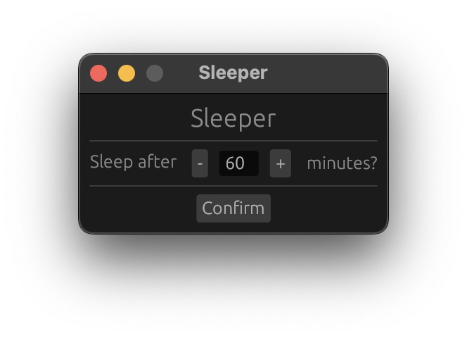
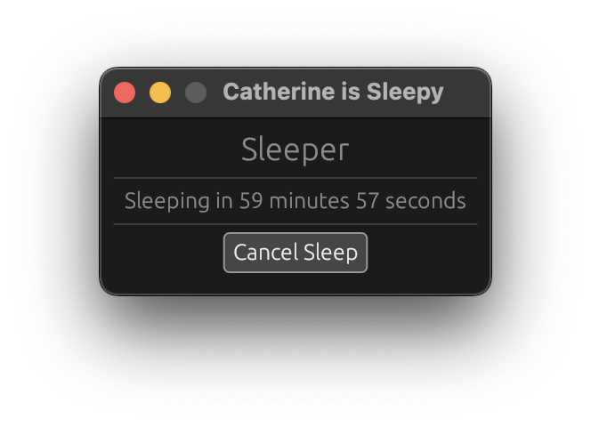

# Sleeper
*Timed Sleep for Macs*

  

## What
Set a time in minutes after which your mac should go to sleep.
This is a GUI alternative to using `sudo sleep -s +MINUTES` (also without needing root)
## Why
There is no (simple) built in Apply way for non-terminal savy people to set their computer to sleep after a given amount of time
## Usecase
Do you enjoy watching a TV show while falling to sleep, but don't want to be woken up by the theme song when a new episode starts in an hour's time?

This is the app for you!

  

